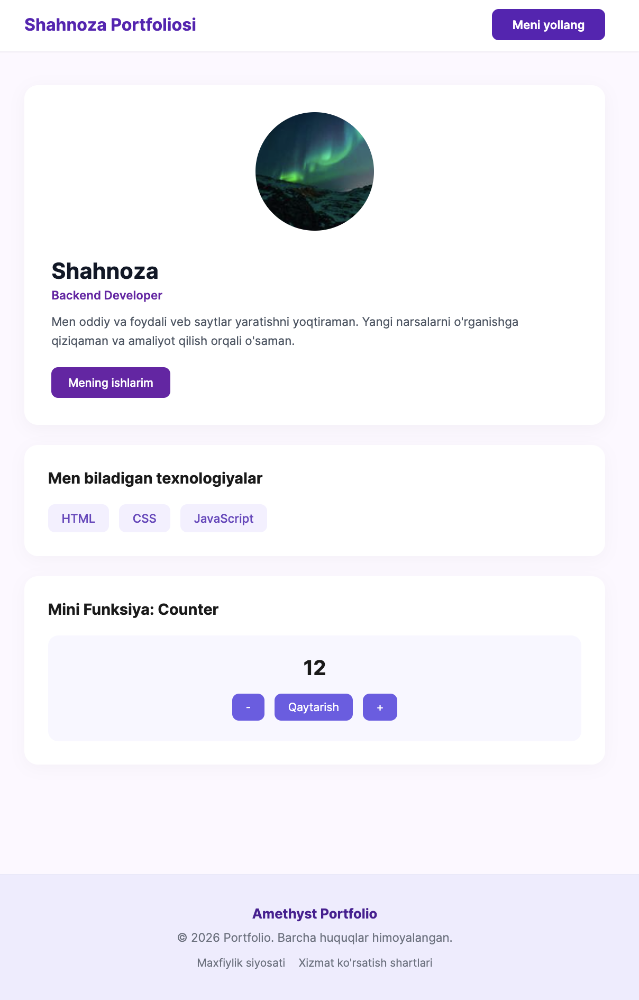
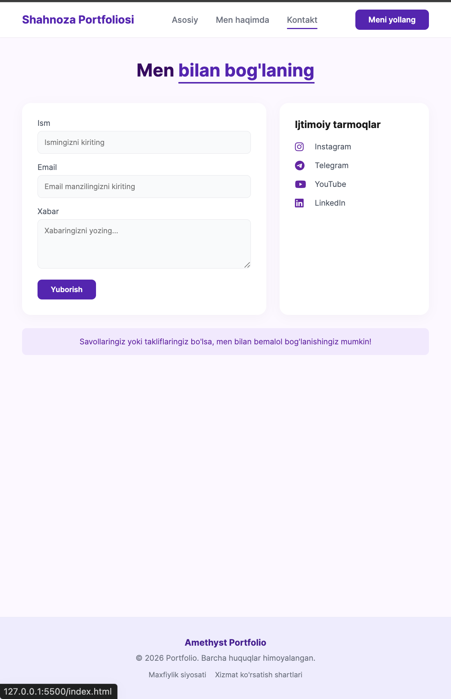

# 🌐 Shahnoza Portfolio

Backend Developer shaxsiy portfolio veb-sayti. Ushbu loyiha zamonaviy va sodda dizayn asosida yaratilgan bo'lib, ishlab chiquvchi haqida ma'lumotlar, biladigan texnologiyalari hamda interaktiv funksiyalarni o'z ichiga oladi.

## Loyiha ko'rinishlari (Screenshots)

| Mobile Versiya 1 | Mobile Versiya 2 | Mobile Versiya 3 |
| :---: | :---: | :---: |
|  |  |  |

---

## 🚀 Texnologiyalar (Tech Stack)

- **HTML5** — Veb-sahifalarning strukturasi
- **CSS3** — Figma maketiga mos ravishda tayyorlangan vizual stillar
- **JavaScript** — Interaktiv interfeys (Counter funksionalligi)
- **Git & GitHub** — Versiyalarni boshqarish va kodlarni saqlash

---

## 📁 Loyiha strukturasi

```text
my-portfolio/
├── index.html      # Asosiy sahifa
├── about.html      # Men haqimda sahifasi
├── contact.html    # Bog'lanish sahifasi
├── style.css       # Asosiy CSS stillari
├── script.js      # JavaScript mantig'i
└── README.md       # Loyiha haqida ma'lumotnoma
```


## 🔗 Demo Havola

Loyihaning jonli versiyasini quyidagi havola orqali ko'rishingiz mumkin:
👉 [Shahnoza Portfolio Live](https://shaxinoz.github.io/my-portfolio/)